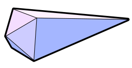

<h1 align="center">Vx.Shard</h1>

    

This is my epic engine designed for the DIT455 Game Engine Architecture course.

## Current specz
* Extremely modular
* Drop in systems for generic Graphics, with a visitor interface for dead-simple renderers.
* Drop in systems for SDL rendering.

## Todo
* Comments
* Improve existing systems
* More nice to have engine features
* Sound system
* Collision system
* Resource manager (no clear idea yet)
